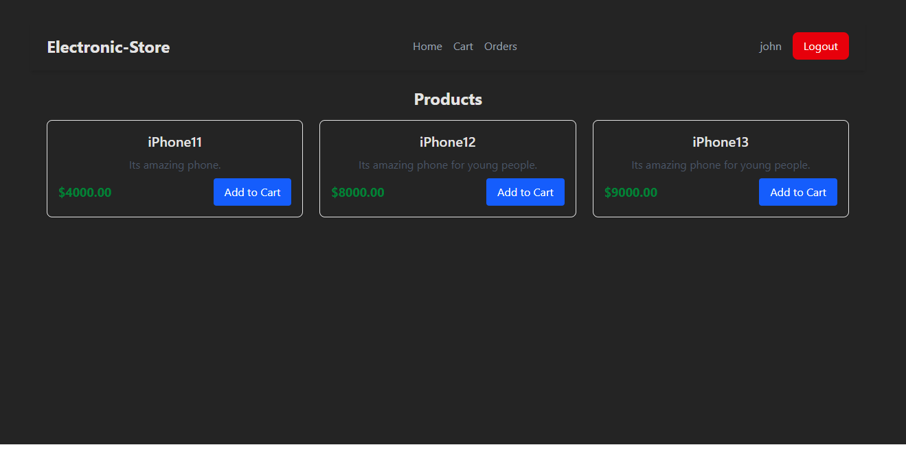
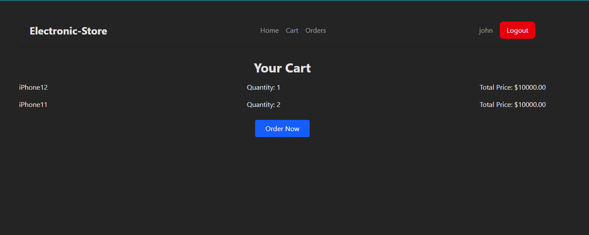
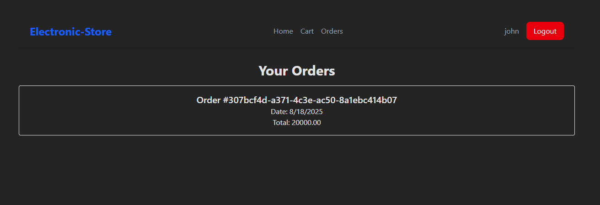
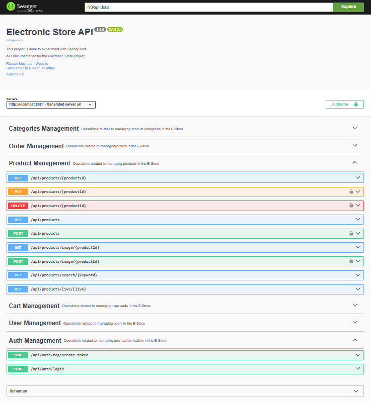

# Electronic Store - Full Stack Web Application

A Prototype of end-to-end e-commerce platform for electronics, built with modern technologies.

---

## Tech Stack

- **Frontend:** React (Vite, TypeScript, Tailwind CSS)
- **Backend:** Spring Boot (Java)
- **Database:** MySQL, Spring Data JPA
- **Containerization:** Docker & Docker Compose

---

## Features

- User authentication & authorization
- Product management (CRUD)
- Category management
- Shopping cart
- Order processing
- Basic UI

---

## Project Structure

- `frontend-app/` — React frontend
- `ElectronicStore/` — Spring Boot backend
- `docker-compose.yml` — Multi-container orchestration

---

## Getting Started

### Prerequisites

- [Docker](https://www.docker.com/products/docker-desktop) & Docker Compose

### Quick Start

1. Clone the repository:
   ```sh
   git clone https://github.com/RizwanMushtaq/ElectronicStore
   cd ElectronicStore
   ```
2. Build and start all services:
   ```sh
   docker-compose up
   ```
3. Access the app:
   - Frontend: [http://localhost](http://localhost)
   - Backend API: [http://localhost:8081/api](http://localhost:8081/api)
   - Swagger UI: [http://localhost:8081/api/swagger-ui/index.html](http://localhost:8081/api/swagger-ui/index.html)

---

## Modules

- **User**: Registration, login, profile
- **Product**: List, add, update, delete products
- **Category**: Organize products
- **Cart**: Add/remove products, view cart
- **Order**: Place and view orders

---

## Frontend App References

Below are some screenshots of the application:

### Home Page



### Cart Page



### Orders Page



### API Documentation (Swagger UI)


